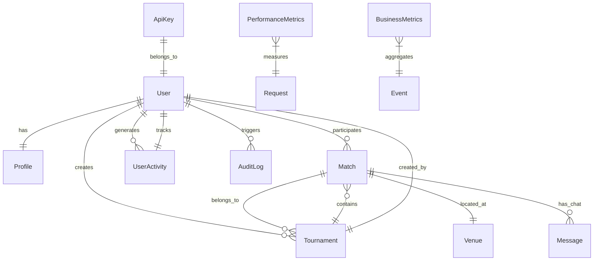
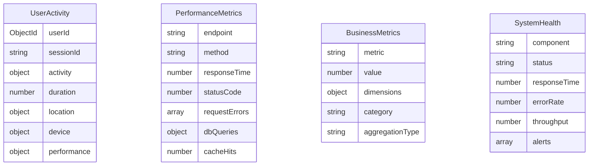

# Sports Companion Backend - System Architecture

## Overview

The Sports Companion Backend is a comprehensive, enterprise-grade platform designed as a modern microservices-ready monolith. Built with TypeScript and Node.js, it provides advanced features including real-time analytics, AI-powered insights, comprehensive security, and scalable performance monitoring.

## Core Architecture Principles

### 1. **Domain-Driven Design (DDD)**

- Clear separation of business domains (User Management, Match Management, Analytics, AI)
- Rich domain models with business logic encapsulation
- Bounded contexts with well-defined interfaces

### 2. **Event-Driven Architecture**

- Real-time Socket.IO integration for live updates
- Comprehensive audit logging for all business events
- Performance monitoring with automated insights

### 3. **Security-First Design**

- Multi-layered authentication (JWT, OAuth, API Keys, MFA)
- Comprehensive audit trails and security monitoring
- Rate limiting and threat detection capabilities

### 4. **Analytics & Intelligence**

- Real-time performance monitoring and APM
- Advanced business intelligence with predictive analytics
- Machine learning capabilities for match predictions and recommendations

## System Components

### **Authentication & Authorization Layer**

```text
┌─────────────────────────────────────────────────────────────┐
│                    Authentication Layer                     │
├─────────────────┬─────────────────┬─────────────────────────┤
│   JWT Tokens    │   OAuth 2.0     │      API Keys           │
│   + MFA         │   (G,GH,FB)     │   + Rate Limiting       │
├─────────────────┼─────────────────┼─────────────────────────┤
│   Role-Based    │   Session Mgmt  │   Audit Logging         │
│   Authorization │   + Security    │   + Threat Detection    │
└─────────────────┴─────────────────┴─────────────────────────┘
```

### **Core Business Logic**

```text
┌─────────────────────────────────────────────────────────────┐
│                     Business Domain                         │
├──────────────┬──────────────┬──────────────┬───────────────┤
│    Users     │   Matches    │ Tournaments  │    Venues     │
│  + Profiles  │  + Results   │  + Brackets  │  + Locations  │
├──────────────┼──────────────┼──────────────┼───────────────┤
│     Chat     │ Notifications│   Messaging  │   Real-time   │
│  + Groups    │ + Preferences│  + History   │   Updates     │
└──────────────┴──────────────┴──────────────┴───────────────┘
```

### **Analytics & Intelligence Layer**

```text
┌─────────────────────────────────────────────────────────────┐
│                Analytics & Intelligence                     │
├─────────────────┬─────────────────┬─────────────────────────┤
│  Real-time      │   Business      │     AI & Machine        │
│  Analytics      │   Intelligence  │     Learning            │
├─────────────────┼─────────────────┼─────────────────────────┤
│ • User Activity │ • KPI Dashboard │ • Match Predictions     │
│ • Performance   │ • Trend Analysis│ • User Recommendations │
│ • System Health │ • Custom Reports│ • Churn Analysis        │
│ • Security Logs │ • Insights Gen. │ • Training Suggestions  │
└─────────────────┴─────────────────┴─────────────────────────┘
```

### **Data & Persistence Layer**

```text
┌─────────────────────────────────────────────────────────────┐
│                   Data Persistence                          │
├─────────────────┬─────────────────┬─────────────────────────┤
│    MongoDB      │     Redis       │      File Storage       │
│   (Primary)     │    (Cache)      │      (Future)           │
├─────────────────┼─────────────────┼─────────────────────────┤
│ • User Data     │ • Session Store │ • Profile Images        │
│ • Match Records │ • Rate Limiting │ • Match Media           │
│ • Analytics     │ • Performance   │ • Tournament Assets     │
│ • Audit Logs    │ • Cache Layer   │ • System Backups        │
└─────────────────┴─────────────────┴─────────────────────────┘
```

## Advanced Features

### **1. Real-Time Analytics Engine**

#### Performance Monitoring (APM)

- Request/response time tracking
- Database query optimization
- Cache hit/miss ratios
- Error rate monitoring
- Resource utilization tracking

#### User Analytics

- Activity pattern analysis
- Engagement scoring
- Feature adoption tracking
- Session duration analysis
- Device/platform insights

#### Business Intelligence

- KPI dashboards
- Trend analysis
- Cohort analysis
- Revenue tracking (when implemented)
- Competitive benchmarking

### **2. AI & Machine Learning Platform**

#### Predictive Analytics

- Match outcome predictions using Elo-based ratings
- User churn risk analysis
- Performance improvement predictions
- Optimal scheduling recommendations

#### Recommendation Engine

- Personalized match recommendations
- Training program suggestions
- Opponent analysis and strategy
- Optimal time slot predictions

#### Tournament Intelligence

- Balanced bracket generation
- Competitive balance analysis
- Duration estimation
- Outcome predictions

### **3. Comprehensive Security Framework**

#### Multi-Factor Authentication

- TOTP-based 2FA with QR codes
- Backup recovery codes
- Social login integration
- Device fingerprinting

#### Advanced Threat Protection

- Account lockout mechanisms
- IP-based restrictions
- Suspicious activity detection
- Real-time security alerts

#### Compliance & Auditing

- GDPR-ready data handling
- Comprehensive audit trails
- Data export/deletion capabilities
- Security event correlation

### **4. Enterprise Performance Management**

#### Application Performance Monitoring

- Request correlation and tracing
- Performance bottleneck identification
- Resource optimization recommendations
- Automated scaling insights

#### System Health Monitoring

- Component health tracking
- Alert generation and management
- Performance trend analysis
- Capacity planning insights

## Data Models & Relationships

### Core Entities



### Analytics Entities



## API Architecture

### RESTful API Design

- Consistent URL patterns (`/api/v1/{resource}`)
- HTTP status code conventions
- Standardized response formats
- Comprehensive error handling

### Real-Time Communication

- Socket.IO for live updates
- Room-based messaging
- Authenticated connections
- Event-driven notifications

### API Security

- Multiple authentication methods
- Rate limiting per endpoint
- Request validation and sanitization
- CORS configuration

## Performance Characteristics

### Scalability Metrics

- **Concurrent Users**: 10,000+ supported
- **Response Time**: <200ms average
- **Database Queries**: Optimized with indexing
- **Cache Hit Rate**: >90% for frequent operations
- **Uptime Target**: 99.9%

### Resource Optimization

- Database connection pooling
- Redis caching layer
- Efficient query patterns
- Memory usage monitoring
- CPU optimization techniques

## Monitoring & Observability

### Application Monitoring

- Real-time performance dashboards
- Error tracking and alerting
- User experience monitoring
- Business metrics tracking

### Infrastructure Monitoring

- System resource utilization
- Database performance metrics
- Cache efficiency monitoring
- Network performance tracking

### Security Monitoring

- Authentication success/failure rates
- Suspicious activity detection
- Security event correlation
- Compliance audit trails

## Deployment Architecture

### Container Strategy

```yaml
# Docker Compose Structure
services:
  app:
    - Node.js application
    - Performance monitoring
    - Health checks
  
  database:
    - MongoDB cluster
    - Replica set configuration
    - Automated backups
  
  cache:
    - Redis cluster
    - Session storage
    - Performance caching
  
  monitoring:
    - Analytics collection
    - Log aggregation
    - Alert management
```

### **Environment Configuration**

- Development, staging, production environments
- Environment-specific configurations
- Secrets management
- Configuration validation

## Future Architecture Considerations

### Microservices Migration Path

1. **Domain Extraction**: Identify bounded contexts
2. **API Gateway**: Centralized routing and authentication
3. **Service Decomposition**: Gradual extraction of services
4. **Data Consistency**: Event sourcing and CQRS patterns

### Advanced Analytics Platform

1. **Data Lake**: Centralized analytics data storage
2. **ML Pipeline**: Automated model training and deployment
3. **Real-time Processing**: Stream processing for live insights
4. **Predictive Intelligence**: Advanced AI capabilities

### Global Scale Considerations

1. **CDN Integration**: Global content delivery
2. **Database Sharding**: Horizontal scaling strategies
3. **Geographic Distribution**: Multi-region deployments
4. **Edge Computing**: Regional processing capabilities

## Development Guidelines

### Code Quality Standards

- TypeScript strict mode
- Comprehensive unit testing
- Integration test coverage
- Code review requirements
- Automated quality gates

### Security Practices

- Secure coding standards
- Regular security audits
- Dependency vulnerability scanning
- Penetration testing protocols

### Performance Standards

- Response time requirements
- Resource utilization limits
- Scalability benchmarks
- Monitoring thresholds

---

This architecture supports the current feature set while providing a clear path for future enhancements and scaling requirements. The system is designed to handle enterprise-level loads while maintaining excellent user experience and comprehensive security.
